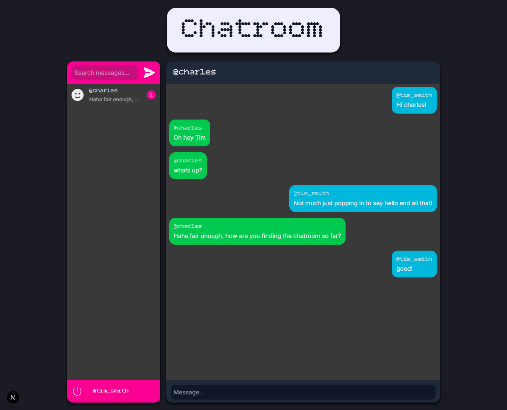
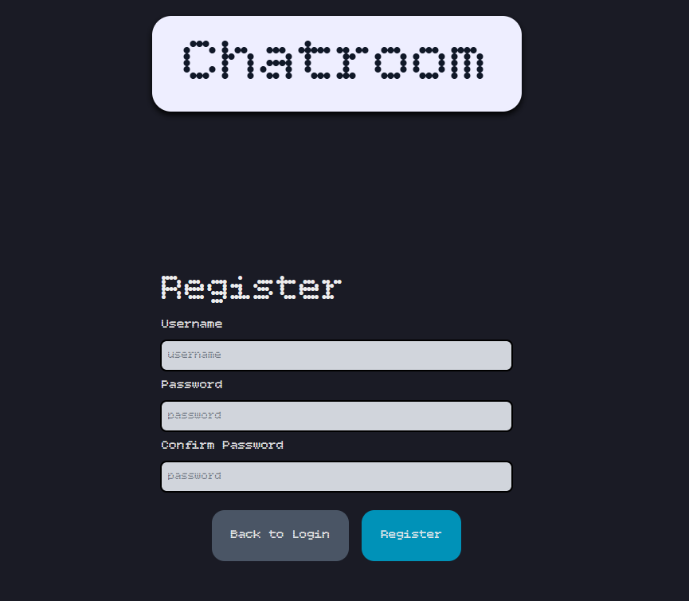
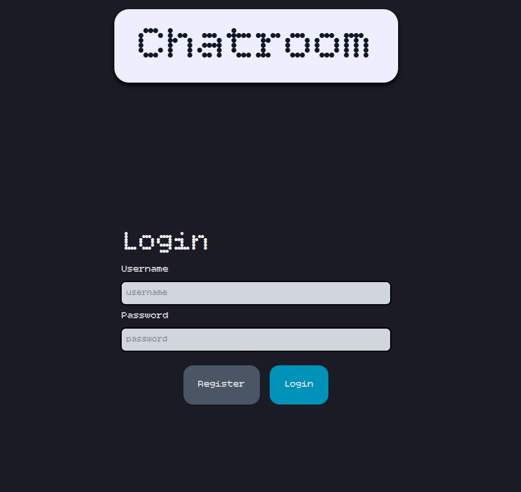

# Chatroom Website


## Features

- User authentication and sign-up.
- Instant messaging online webpage.
- Unread notifications indicator.
- No AI agents used, AI only for researching.

## Technologies Used

- Next.js
- TailwindCSS
- Postgres (via Supabase tho can be swapped in the .env)
- Bun

## To do / Possible Improvements

- Replace polling system with websockets.
- Add skeleton UI during loading.
- Add mobile screen size support (friendlist disappears).

## Getting Started

First, run the development server:

```bash
bun dev
```

Open [http://localhost:3000](http://localhost:3000) with your browser to see the result.

## Deployed Example

- Not publically hosted yet.

## Screenshots

<div align="center">
  
  
  
</div>
